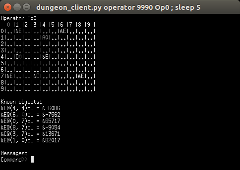

.. _progress-report:

===============
Progress Report
===============

Milestones
==========

August 21
---------

We have upgraded the testing code to incorporate proactive rebellions, the ratio
between the size of the world and the number of NPCs and the ratio between the
number of enemies and civilians. We also added more detailed logging to the testing
code, so that the results of each tests are captured more explicitly and are
easier to use. Finally, we've filled out the documentation both at the code level
and the broader usage and overview documentation. The documentation we've generated
should allow anyone else who comes to work on this project to easily pick up where
we left off.

August 9
--------

We have added a basic form of proactive rebellion to the agents, such that if an
agent sees that another agent is preparing to execute a goal which should not be
executed, it will inform the agent and hopefully cause the other agent to rebel.
Right now, the knowledge of what should cause an agent to encourage another agent
to rebel is hard-coded in, such that all agents look for other agents which are
either arming or armed, and then try and determine their goal. If the ascertained
goal of the other agent is one which the original agent finds unacceptable, it
will identify which civilians will be caught in the blast and then informs the
other agent about the presence of those civilians.

We have also added compliance to the agents, which dictates how they react to an
operator rejecting their rebellions. The more compliant an agent is, the more it
is willing to accept the rejection of a rebellion and to carry out the goal.


August 4
--------

We have just completed adding code which allows us to run multiple,
configurable tests sequentially with minimal effort. The testing code
allows us to specify a variety of options, including the size of the
board, the number of enemies, civilians, or agents, and the length of
time each test should run for. The testing code records the resulting
score of each test (currently the proportion of enemies killed and the
proportion of civilians alive), and stores the results of all tests in a
file.

July 27
-------

We have managed to get many agents running simultaneously, and have an
automated operator which can give instructions to and interact with
agents. We successfully tested a single automatic operator working with
five agents on a 25x25 drone domain. The agents killed every enemy
target which didn't have civilians within the area of effect, while the
operator handled all rebellions properly.

July 21
-------

We successfully have an agent rebelling against an operator-given goal,
communicating its rebellion and reasons for rebelling with the operator.
The domain which we have created for testing rebellion is rather simple,
consisting of some number of agents and operators, as well as enemies
and civilians. Walls, doors, and several other features remain available
to us as well. An agent is capable of detonating a bomb, which kills any
enemy or civilian within the bomb's radius (default 2 tiles) of the
agent. Civilians should not be killed, but enemies should be. We can
call this domain the "drone domain." MIDCA still forms the core of our
code, running the agent's cognitive process. However we have added a
number of other features which allow for more clear rebellion and easier
testing, such as simulating the world separately from MIDCA and allowing
multiple operators and agents.

Changes to Previous Version
===========================

August 21
---------

Improved testing
~~~~~~~~~~~~~~~~

We added rebellion and proactive rebellion toggling to the testing code, which
allows us to see what effect rebellion and proactive rebellion actually have on
the simulation. The most significant upgrade, however, was the way in which test
runs are recorded. We added logging which captures and records the results of
all runs under a specific set of test parameters, logging which records each event
in the world, and logging which records each instance of rebellion. The cumulative
results of a batch of tests are recorded in ``testRecords.csv``, the record of
each simulation is in ``logs/eventLogs``, and each recorded rebellion is in
``logs/rebellions``. Additionally, the :py:class:`~testing.TestRecords` object which is used to
collect most of this data is pickled and stored in ``testRecords.txt``.

Documentation
~~~~~~~~~~~~~
We wrote a nice :ref:`user-guide` which should help new researchers get acquainted
with the rebel agent code.

August 9
--------

Proactive rebellion
~~~~~~~~~~~~~~~~~~~

The new code which enables proactive rebellion resides in two new MIDCA modules
for the agent: :py:class:`~modules.interpret.GoalRecognition` and
:py:class:`~modules.evaluate.ProactiveRebellion`. The former examines all other
agents in the world and determines the goal of each of them. It then stores each
agent and its corresponding goal in MIDCA's memory. The latter looks through all
stored goal-agent pairs and checks whether each goal is valid, according to its
knowledge of the world. If the goal is not valid, it informs the agent in question
about why it would not be valid. This, in turn, may cause the agent whose goal
was found to be invalid to rebel.

Agent Compliance
~~~~~~~~~~~~~~~~

The code which allows us to adjust the compliance level of an agent has been added
to the :py:class:`~modules.evaluate.HandleRebellion` module. The level of compliance
of an agent corresponds to the probability that, once the agent has rebelled
against a goal and the operator has responding by rejecting the goal, the agent
will accept that rejection and carry out the goal. The compliance of the agent
should be given to it at instantiation of the `HandleRebellion` module as a real
value between 0 and 1. If the agent does comply with an operator's rejection of
a rebellion, it will remember the goal in question as mandatory and will rebel
against it again. Otherwise, the agent will continue to rebel.

August 4
--------

Easy Testing
~~~~~~~~~~~~

We have added testing code which allows us to run multiple tests in one
go and collect the results. The testing functions are in ``testing.py``,
and are called from the demo code. There are two primary functions for
this: ``~testing.run_visible_test`` and ``~testing.run_test``. ``run_visible_test``
is somewhat deprecated, but still kept around because, as the name suggests, it
allows us to run tests where each agent is opened in a different (and thus easily
visible) terminal. The ``run_test`` function runs each agent in an invisible
``Process`` using python's ``multiprocessing`` library.The function takes as
input a world to run the test on, a time limit for running the test (in seconds),
a ``bool`` which determines whether agents should rebel or not, and a ``float``
between 0.0 and 1.0 which determines the probability that an operator
rejects a rebellion. The function returns the final score of the world
as given by ``world.score``.

Logging
~~~~~~~

As part of making tests easier, they also became invisible, and so we
added logging functionality into the code. A single python ``Logger``
object is created for each agent and operator at the beginning of a run
of tests, and every MIDCA module takes the ``Logger`` as input. Each
module logs important info, which is stored in a ``.log`` file named for
the agent in question. The world server and the ``World`` object itself
also log info which is useful to know.

July 27
-------

Many Agents
~~~~~~~~~~~

We have added the ability for many agents to be running and interacting
with the world simultaneously. In the previous version, the MIDCA cycle
which controlled the agent was run in ``rebel_demo.py`` itself, which
meant that only one agent MIDCA cycle could be run and still have stable
output. [1]_ We offloaded this from the demo script by creating a class
``RemoteAgent`` in ``world_communications.py`` which runs the MIDCA
cycle and contains a ``MIDCAClient`` to use. Then we added the ability
to create and run a ``RemoteAgent`` by calling the file with certain
command-line arguments. Finally, we changed the demo script so that it
creates a new process and calls ``world_communications.py`` with the
appropriate arguments for every agent in the world file it loads.
Additionally, the processes redirect ``stdout`` to a logging file
specific to the agent itself. [2]_

Automatic Operators
~~~~~~~~~~~~~~~~~~~

In order to facilitate faster testing, we also created an
``AutoOperator`` class in ``world_communications.py`` which is able to
autonomously manage any number of agents based on simply policies. The
``AutoOperator`` class is very similar to the ``RemoteAgent`` class, in
that it contains a MIDCA cycle and an ``OperatorClient``, is run in a
new process, and redirects ``stdout`` to a log file. As noted above,
however, the MIDCA cycle of the operator is significantly different from
the agents'. The policy of the operators dictates two things: how they
assign goals (based on the Plan phase module) and how they handle
rebellions (based on the Eval phase module). Currently, we only have one
policy for goal assignment and one for rebellion handling. The former
assigns agents to kill the closest enemy to them, while the latter tries
to accept an alternate goal first, but then chooses not to give the
agent a goal if there are no alternatives.

Improved Actor communication
~~~~~~~~~~~~~~~~~~~~~~~~~~~~

In response to difficulties arising from multiple agents and larger
worlds, we made two modifications to the way actors interact with each
other and with the world server. The first regards the way a client
receives data from the server (and, minorly, how the server sends it),
while the second deals with the operator's ``inform`` command.

Previously, clients received data from the server by querying it, then
listening for a fixed number of bytes (usually 2048). However, the size
of some pieces of information, namely the world state and actor objects,
is dynamic and increases with the size of the map and the number of
cycles run. Thus, at large map sizes and after long runs, the data being
sent to the client was larger than expected. To handle this, we altered
the way the server sends data so that a message ends with a terminal
character (¬). The client's ``recv`` method reads in chunks of 2048
bytes, concatenating them until it finds the terminal character. This
allows us to send dynamically sized messages.

In order to automate the operator, we had to change the previous
behavior of the ``inform`` command, which asked for user input
concerning the ID of the object and the ID of the recipient. Now, the
``inform`` method takes two arguments ``recipientID`` and ``objID``. The
automatic operator calls this function directly, while a human operator
would now add the two arguments to the end of the ``inform`` command
(see ```inform`` <#inform>`__).

July 21
-------

World State Representation
~~~~~~~~~~~~~~~~~~~~~~~~~~

Our world state representation differs significantly from MIDCA's, and
that remains true. We still use a ``Dungeon`` object to represent and
manipulate the simulated world. However, the ``Dungeon`` object is now
capable of containing multiple agents and multiple operators, all of
whom are represented as ``Agent`` objects. We also created an additional
``DungeonObject`` subclass, ``Npc``, which is used to represent enemies
and allies. It keeps track of whether the NPC is an enemy or a civilian
and whether the NPC is alive or dead. Finally, we created an
``Agent.bomb()`` method and a ``Dungeon.bombed_at(location)`` method,
which allow agents to detonate a bomb at their location. Any NPC within
the radius of the bomb (default 2 tiles) is killed. They are NOT removed
from the world, but their status is set to dead and they no longer are
presented in the world view.

World Simulation
~~~~~~~~~~~~~~~~

In order to facilitate multiple agents and operators, we refined the way
they interact with the simulated world and with each other. Previously
the MIDCA cycle simulated the world and the various MIDCA modules could
and did interact directly with the ``Dungeon`` object which had the full
world state. There was a Simulate phase for MIDCA, which applied actions
to the dungeon and then updated any remote operators. In the new
version, simulation is performed by a separate sub-process living on a
SocketServer, and the MIDCA cycle of an agent only has access to the
world through a client provided to each phase. Operators are similarly
remote to the simulation, and also access the world through a client. An
agent can act upon the world through a specific communication between
its client and the world, which will trigger the server to simulate the
result of that action. Agents and operators also use their clients to
request updates on the world state.

Actor communication
~~~~~~~~~~~~~~~~~~~

Actors (i.e. agents and operators) communicate with each other by
passing messages or instructions to the simulation server and requesting
any messages they may have received since their last update. This is not
particularly efficient in some respects (particularly for operators) and
may need to be upgraded at some point. The kinds of information which
actors can communicate fall into three categories: information about
objects or other actors, goals, and text messages.

Passing information about objects or actors does not require the
recipient to poll for new updates, the server automatically adds the new
information to the recipient's knowledge. However goals and messages do
require the recipient to ask for updates. Goals have so far only been
sent from operators to agents, but it is equally possible for agents to
send goals to each other if we desire. When a goal is sent, the server
stores it in a dict with the recipient's ID as the key, and when the
recipient polls for new goals during the interpret phase (using the
``RemoteUserInput`` module) the server returns a list of all goals (in
the form of strings) sent to the agent. The module then interprets those
strings as goals and inserts them into the goal graph. In addtion to
having a predicate and arguments, the goal also keeps track of the user
giving the goal. A similar process is used for text messages in that the
server stores received text messages in a dict with the recipient's name
as a key. Each message is stored as a pair with the message string first
and the sender's ID second. An actor can poll for all messages it should
receive or for all messages sent to it from a single sender, if in the
midst of conversing with that actor.

Rebellion
~~~~~~~~~

The most significant change is the addition of a new module,
``HandleRebellion``, in the Evaluation phase, and the addition of
rebellion-generating code in the pre-existing ``GoalManager`` module,
also in the Evaluation phase. Some helper functions were also added to
the ``Agent`` class. The mechanics of rebellion are fairly simple at the
moment, since the rebellion trigger is somewhat hard coded. Currently,
if the goal managing module detects an explanation for a discrepancy
which indicates civilians are in the line of fire, it adds a
``Rebellion`` object to MIDCA's memory. The ``Rebellion`` object stores
the goal which is being rejected, the reason why it is being rejected,
and any other information which is pertinent, based on the cause of the
rebellion. This is to allow the ``Rebellion`` class to be used for all
kinds of rebellions, although currently we just have one.

After the goal manager has completed its run, the rebellion handling
module looks in MIDCA's memory for any rebellions. Any rebellion found
is handled in the following way

#. The goal is removed and the user is alerted to the rebellion.
#. Actions specific to the rebellion (e.g. informing the user of the
   locations of civilians) are performed.
#. Alternate goals are generated based on the reason for rebellion.
#. The users is informed of these possible alternate goals, and asked to
   select one.
#. The agent waits for the user's selection, and then adds the specified
   goal to the goal graph. The user can also specify None, in which case
   no goal is added.

Operation
=========

Creating a Demo World
---------------------

Creating a demo world can be done by running

::

    python dungeon_utils.py

which will randomly generate a 10x10 cell map with 4 civilians, 5
enemies, an agent and an operator. These numbers can be adjusted in
``dungeon_utils.py``. Additionally, lines in the file can be uncommented
to allow a user to create a custom map using an interactive dungeon
maker. This allows the user to place and remove dungeon objects, agents,
and operators and then save the file.

Running the Demo
----------------

To run the currently existing demo, use the command

::

    python rebel_demo.py

which will begin begin running the world simulation server, the agent's
client and the operator's client in three separate terminals. The
agent's client will be the original terminal in which the command was
entered. The operator's client should be marked as such, and the world
server should only display a world map. The map being used is
``dng_files/drone_demo.dng``, which contains 4 civilians, 5 enemies, an
agent, and an operator.

To use a different map, the line assigning ``DUNGEON_FILE`` must be
changed. It is important to note that ``rebel_demo.py`` provides support
for only one active agent to be running, although any number of
operators is allowed.

Operator Usage
--------------

Once a demo is running, the only way the user can interact with it is
through the operators' clients. Each client presents the user with
several pieces of information, as seen in Figure 1.

| *Figure 1: The Operator Terminal*
| |Operator's Terminal|

At the top line of an operator's terminal is the operator's name, in
this case "Op0". Below it is a map of the world which refelects all of
the operator's knowledge.\ ``&E`` indicates an enemy, while ``&C``
indicates a civilian. Tiles with an ``O`` followed by a number represent
the location of operators, and tiles with an ``A`` followed by a number
represent agents.Below the map is a list of known objects, each of which
is displayed as a short-form representation and its corresponding ID
code. Finally, any messages received by the operator are displayed. In
order to update the information on the terminal, the user must either
give a command or hit return.

There are a handful of commands operators have to interact with the
agent or with the world directly:

``action``
~~~~~~~~~~

The ``action`` command allows an operator to act in the world directly.
The operator can do *any action* which the agent is capable of, both
moving and detonating bombs. There exist other actions which both agent
and operator can do, but those are left over from the dungeon
environment. The general format of an ``action`` command is:

::

    action op(args)

and more specifically should look like

::

    action move(n|s|e|w)
    action bomb()

``op`` is the action which the operator should take, and ``args`` are
the corresponding arguments. The values for ``op`` and ``args`` given
above are the pertinent ones, although others exist, as noted above.
Once an ``action`` command is given, the world simulator will
immediately apply it and the operator's view will be updated.

\ ``inform``\
~~~~~~~~~~~~~~

The ``inform`` command allows an operator to inform another actor about
the existence and properties of a specific object or actor. The general
format of the ``inform`` command is:

::

    inform recipientID objID

``recipientID`` is the ID of the actor to be informed, and ``objID`` is
the ID of the object (or actor!) which the recipient should be informed
of. Once this message is passed, the server immediately imparts
knowledge of the object onto the recipient.

``direct``
~~~~~~~~~~

The ``direct`` command allows an operator to give agents a goal. The
general format for the ``direct`` command looks like

::

    direct agentName predicate(args)

and more specifically

::

    direct agentName agent-at(x,y)
    direct agentName killed(targetID)

The ``agentName`` should be the unique identifying name of the agent
which should be give the goal. This name is the same as the one used in
the ``inform`` command. ``predicate`` should be a valid goal predicate,
of which ``agent-at`` and 'killed' are pertinent to our demos. The
``agent-at`` predicate takes a location on the board as its argument and
the ``killed`` predicate takes the ID code of the target. Unlike
``action`` and ``inform``, once a goal is sent, the agent must cycle
through MIDCA to the ``RemoteUserInput`` module before it picks up the
goal. Also unlike the previous two, the receiving agent should send a
confirmation message to the operator indicating the goal was added.

``say``
~~~~~~~

The ``say`` command sends a text message to another actor which appears
in their messages queue. This allows for bi-lateral communications
between two actors. The format of the ``say`` command is

::

    say actorName message

``actorName`` is the name of the actor which should receive the message,
and ``message`` can be any well-formed string. Once the command is
given, the server adds the message, along with the operator's name, to
the recipient's message queue. The recipient does not receive the
message until it polls for new messages, however. Currently, the only
use of the ``say`` command in terms of agent-operator communication is
for the operator to respond to a rebelling agent. The ``say`` command is
used to select an alternative goal.

Current Progress
================

We now have the ability to run multiple agents, each capable of
independent rebellion and managed by an autonomous operator. Agents have
demonstrated the ability to rebel, communicate with the operator, and
accept an alternate goal. Currently, the only instance an agent will
rebel is if it has a ``killed`` goal, and the location it chooses to
bomb has civilians within the bomb's radius.We also have the ability to
run multiple operators, although this has not been tested with multiple
autonomous operators.

.. _futwork:

Future Work
===========

There are a handful of practical problems which may be worth addressing
in addition to future research directions.

Research Directions
-------------------

-  Proactive rebellion, including agent-agent communication and some way
   of detecting a fellow agent's goal.
-  Social factors, like trust and social pressure.
-  Choosing between conflicting orders from multiple operators.

Practical
---------

To do
~~~~~


Completed
~~~~~~~~~

-  Ensure agent-agent communication works well.
-  Change the way agents and operators log their actions and
   observations.
-  A better operator interface would be very useful for testing in the
   future.
-  We should list agent names somewhere in the operator terminals so the
   user can see all available agent names.
-  Operators should be able to be modular and autonomous.



.. rubric:: Footnotes

.. [1] It is possible to have run multiple MIDCA cycles on several threads within the demo script, but output would have been garbled.

.. [2] This has been fixed, and logging is now done through python's built-in `logging` library. (8/9/17)
